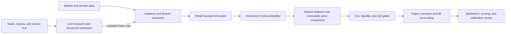

# Kalshi Forecasting Lab

[](https://github.com/itsnotmarvin/kalshi-trading-agent/actions/workflows/tests.yml)
[](https://www.python.org/)
[](#safety-boundary)

An experimental prediction-market research system exploring how market data and
external evidence can become testable probability forecasts. It combines a
model-backed weather route, market microstructure, provider-assisted research,
paper execution, settlement accounting, and forecast-evaluation tooling.

This repository demonstrates a forecasting and risk system. It does **not**
claim a profitable trading edge.

## What is implemented

| Capability | Current status | Evidence |
| --- | --- | --- |
| Weather probabilities | Model-backed | Open-Meteo GFS ensemble distribution; the LLM may summarize NWS context but cannot add a numeric modifier |
| General-event research | Experimental | The general path still accepts an LLM-generated `my_probability`; search evidence is not yet retained as an auditable fact record |
| Market comparison | Partial | Midpoint, executable-cost, and fee primitives exist; the order-book risk path uses them, while the generic fallback still compares against the YES ask |
| Forecast evaluation | Measurement/gating | Brier score, gated log loss, calibration buckets, directional accuracy, baseline comparison, and walk-forward split helpers exist; no fitted calibrator is applied yet |
| Point-in-time lineage | Partial | Forecast logs exist, but strict pre-resolution cutoffs plus immutable model/input/source versions are not yet enforced end to end |
| Paper execution | Regression-tested | Fill-only accounting, fee-aware P&L, settlement fallback, idempotency, and persistent circuit breakers |
| Profitable edge | **Not established** | The summarized single-market replay lost **$3.42** under its model-timing policy and is explicitly anecdotal |

The strongest part of the project today is its risk, accounting, test, and
scoring scaffolding: forecast logs, paper fills, settlement, costs, and baseline
comparisons. A credible evaluation still requires stricter point-in-time data
lineage. The next architecture milestone is to make every traded domain follow
the model-backed pattern already used for weather.

## System shape



The diagram is the target contract for model-backed routes. The current weather
workflow follows it most closely. General event research is retained as an
experimental path until its probabilities come from a fitted, backtested model.

## Why the LLM is not the forecaster

An LLM is useful for finding and structuring facts such as an injury, lineup
change, forecast discussion, or source timestamp. It should not invent an
adjustment such as `injury = -8%`.

Numeric impacts should come from a fitted model or a deterministic rerun:

```text
impact = P(model | changed validated input) - P(model | original inputs)
```

The weather route enforces this separation: an ensemble produces the
probability, while the NWS discussion reader returns qualitative context with a
numeric modifier of zero. The broader event route is clearly marked experimental
because it has not completed this migration.

Current limitations are explicit:

- The general event schema still asks the LLM for `my_probability`, and that
  output can reach a proposal. It must be hard-gated before this migration can
  be called complete.
- General web-search snippets, source timestamps, conflicts, and quoted evidence
  are not yet persisted as a validated fact record.
- Weather probabilities use ensemble fractions plus Jeffreys smoothing; the
  project measures calibration but does not yet fit a calibration transform.
- Forecast archives still need enforced pre-resolution cutoffs and immutable
  model/input versions.

## Evaluation contract

Prediction quality and trading quality are measured separately:

- **Prediction quality:** Brier score, log loss, calibration, accuracy, and
  performance against naive and market baselines.
- **Trading quality:** net P&L after executable prices, spread, fees, partial
  fills, slippage assumptions, and liquidity/risk gates.

A well-calibrated forecast can still be untradeable if the market already
contains the same information or transaction costs consume the gap.

See [the single-market replay summary](examples/backtest-summary.md) for the
repository's current evidence boundary. It is a diagnostic, not validation.

## Next experiment

Archive fixed-horizon, pre-resolution weather forecasts across many resolved
markets. On chronological holdouts, compare:

1. the raw GFS ensemble probability,
2. a calibration transform fitted only on earlier forecasts,
3. the contemporaneous market midpoint, and
4. executable paper results after spread, fees, and slippage assumptions.

Report Brier score, log loss, Brier Skill Score with uncertainty, probability
buckets, and net paper P&L. Verify each contract's threshold/equality and
settlement rules before scoring. This experiment tests whether the one existing
model-backed route has skill; the architecture alone cannot prove an edge.

## Local setup

The default development configuration is paper-only and uses a mock LLM, so it
does not make paid model calls or place orders.

```bash
git clone https://github.com/itsnotmarvin/kalshi-trading-agent.git
cd kalshi-trading-agent
python3.11 -m venv .venv
source .venv/bin/activate
pip install -r requirements.txt
cp .env.example .env
pytest -q
python server.py
```

Open `http://127.0.0.1:8000`. The dashboard shell loads without trading
credentials; authenticated account and live-market operations require your own
Kalshi configuration.

## Repository map

```text
adapters/                     Exchange interfaces and Kalshi integration
config/                       Environment-backed settings and research prompts
core/agent.py                 Provider-aware research and experimental event path
core/weather_engine.py        Ensemble-based weather probability model
core/forecast_scoring.py      Brier, log-loss, calibration, and baseline scoring
core/market_pricing.py        Midpoint, executable cost, and fee math
core/risk_manager.py          Exposure, liquidity, sizing, and circuit breakers
core/trading_loop.py          Paper/live orchestration and settlement flow
core/world_cup_service.py     Match and combo trade-card workflow
scripts/manual_probes/        Explicit, non-pytest research probes
tests/                        148 automated tests at this cleanup baseline
dashboard.html                Research dashboard
paper.html                    Paper forecasting dashboard
server.py                     FastAPI application
```

## Integrity and safety properties

- Entry and exit calculations include fees; an apparent gap smaller than costs
  is not called an edge.
- Accepted orders do not count as trades—only adapter-reported fills affect
  positions, counters, and P&L.
- Client order IDs are thesis-derived so retries do not silently duplicate a
  position.
- Resolution lookup falls back from expired market endpoints to event data.
- Circuit-breaker state persists across restarts.
- Combo cards expose each leg and require correlation notes; probabilities are
  not multiplied blindly.

These invariants are exercised in
[`tests/test_scoreboard_integrity.py`](tests/test_scoreboard_integrity.py),
[`tests/test_order_idempotency.py`](tests/test_order_idempotency.py), and the
rest of the test suite.

## Safety boundary

Live-order code exists, but this public project is configured and documented for
research and paper validation. The CLI has a session-level confirmation; the
generic dashboard path does **not** provide per-order human approval and is not
suitable for live use. Keep it in paper mode. Independently verify every
forecast, final exchange quote, fee, payout, and liquidity assumption.

Prediction markets involve financial risk. This project is not financial
advice.
